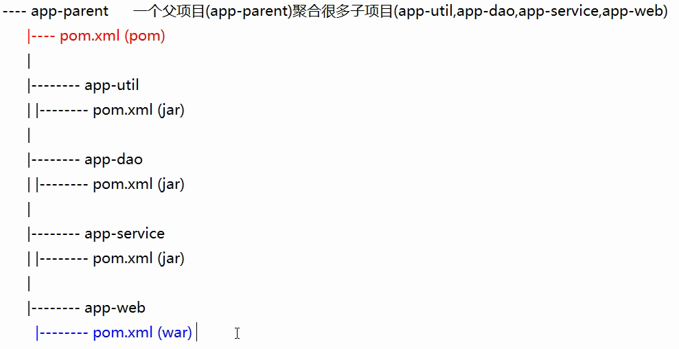
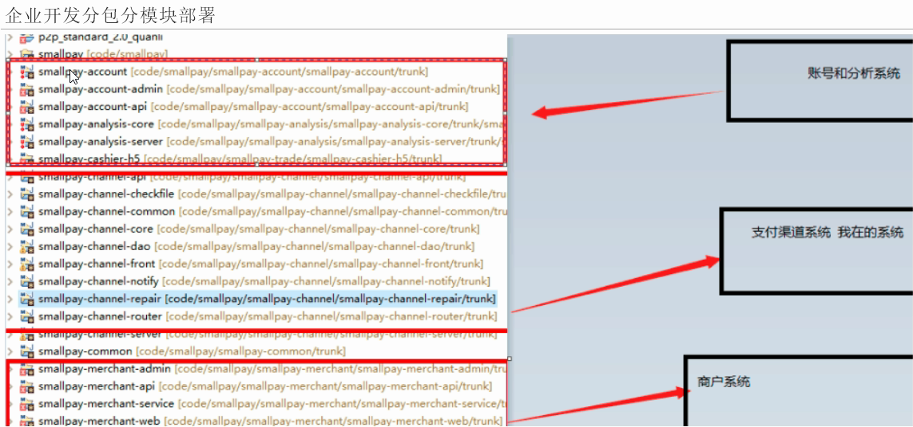

### 基础概念

#### 分模块基本思想

​	传统代码分层，将代码分为controller，service，dao，util等不同包，而maven模块化的结构直接将不同层级的代码分为不同子项目，子项目相互引用构成了一个聚合的父项目。



​	基础的第三方依赖，例如log4j等可以直接在parent中引入，然后子项目通过继承parent间接引入这些依赖。

​	通常不包含静态资源的模块都直接打包成jar包，包含静态资源的例如web模块才打包成war包部署。




#### Pom.xml说明

父pom.xml

```xml
<?xml version="1.0" encoding="UTF-8"?>
<project xmlns="http://maven.apache.org/POM/4.0.0" xmlns:xsi="http://www.w3.org/2001/XMLSchema-instance"
         xsi:schemaLocation="http://maven.apache.org/POM/4.0.0 http://maven.apache.org/xsd/maven-4.0.0.xsd">
    <modelVersion>4.0.0</modelVersion>

    <groupId>com.blysin.springcloud</groupId>
    <artifactId>microservice</artifactId>
    <version>0.0.1-SNAPSHOT</version>
    <!--这里配置了所有子模块-->
    <modules>
        <module>microservice-provider-dept-8082</module>
        <module>microservice-api</module>
    </modules>
    <packaging>pom</packaging>

    <name>microservice</name>
    <description>Demo project for Spring Boot</description>

    <parent>
        <groupId>org.springframework.boot</groupId>
        <artifactId>spring-boot-starter-parent</artifactId>
        <version>1.5.18.BUILD-SNAPSHOT</version>
        <relativePath/> <!-- lookup parent from repository -->
    </parent>

    <properties>
        <project.build.sourceEncoding>UTF-8</project.build.sourceEncoding>
        <project.reporting.outputEncoding>UTF-8</project.reporting.outputEncoding>
        <java.version>1.8</java.version>

        <spring-cloud.version>Dalston.SR1</spring-cloud.version>
    </properties>

    <!--统一的依赖管理，如果子模块需要引入响应的依赖，只要声明groupId和artifactId就行，版本由这里统一管理-->
    <dependencyManagement>
        <dependencies>
            <dependency>
                <groupId>org.springframework.cloud</groupId>
                <artifactId>spring-cloud-dependencies</artifactId>
                <version>${spring-cloud.version}</version>
                <type>pom</type>
                <scope>import</scope>
            </dependency>

            <dependency>
                <groupId>org.springframework.boot</groupId>
                <artifactId>spring-boot-starter-actuator</artifactId>
            </dependency>

            <dependency>
                <groupId>org.springframework.boot</groupId>
                <artifactId>spring-boot-devtools</artifactId>
                <scope>runtime</scope>
            </dependency>
            <dependency>
                <groupId>org.springframework.boot</groupId>
                <artifactId>spring-boot-starter-test</artifactId>
            </dependency>
            <!--AOP-->
            <dependency>
                <groupId>org.springframework.boot</groupId>
                <artifactId>spring-boot-starter-aop</artifactId>
            </dependency>
            <!--多环境配置：profile-->
            <dependency>
                <groupId>org.springframework.boot</groupId>
                <artifactId>spring-boot-configuration-processor</artifactId>
                <optional>true</optional>
            </dependency>
            <!--监控和管理工具-->
            <dependency>
                <groupId>org.springframework.boot</groupId>
                <artifactId>spring-boot-actuator</artifactId>
            </dependency>
            <!--自动配置-->
            <dependency>
                <groupId>org.springframework.boot</groupId>
                <artifactId>spring-boot-starter</artifactId>
            </dependency>
            <!-- https://mvnrepository.com/artifact/tk.mybatis/mapper-spring-boot-starter -->
            <dependency>
                <groupId>tk.mybatis</groupId>
                <artifactId>mapper-spring-boot-starter</artifactId>
                <version>2.1.0</version>
            </dependency>


            <dependency>
                <groupId>com.alibaba</groupId>
                <artifactId>fastjson</artifactId>
                <version>1.2.53</version>
            </dependency>
        </dependencies>

    </dependencyManagement>

    <!--这里配置的依赖会被所有子模块继承，子模块中无需单独引用-->
    <dependencies>
        <dependency>
            <groupId>org.projectlombok</groupId>
            <artifactId>lombok</artifactId>
            <optional>true</optional>
        </dependency>
    </dependencies>

    <build>
        <plugins>
            <plugin>
                <groupId>org.springframework.boot</groupId>
                <artifactId>spring-boot-maven-plugin</artifactId>
            </plugin>
        </plugins>
    </build>

    <repositories>
        <repository>
            <id>spring-snapshots</id>
            <name>Spring Snapshots</name>
            <url>https://repo.spring.io/snapshot</url>
            <snapshots>
                <enabled>true</enabled>
            </snapshots>
        </repository>
        <repository>
            <id>spring-milestones</id>
            <name>Spring Milestones</name>
            <url>https://repo.spring.io/milestone</url>
            <snapshots>
                <enabled>false</enabled>
            </snapshots>
        </repository>
    </repositories>

    <pluginRepositories>
        <pluginRepository>
            <id>spring-snapshots</id>
            <name>Spring Snapshots</name>
            <url>https://repo.spring.io/snapshot</url>
            <snapshots>
                <enabled>true</enabled>
            </snapshots>
        </pluginRepository>
        <pluginRepository>
            <id>spring-milestones</id>
            <name>Spring Milestones</name>
            <url>https://repo.spring.io/milestone</url>
            <snapshots>
                <enabled>false</enabled>
            </snapshots>
        </pluginRepository>
    </pluginRepositories>


</project>
```


### 示例代码分层说明

-   microservice-api：

    核心基础模块，放置的是其他模块都会用到的公共类，例如最基础的domain：Dept.java

-   microservice-provider-dept-8082：

    服务提供者

-   microservice-consumer-dept-8083：

    服务消费者


